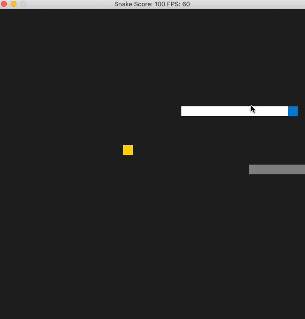
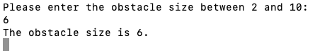
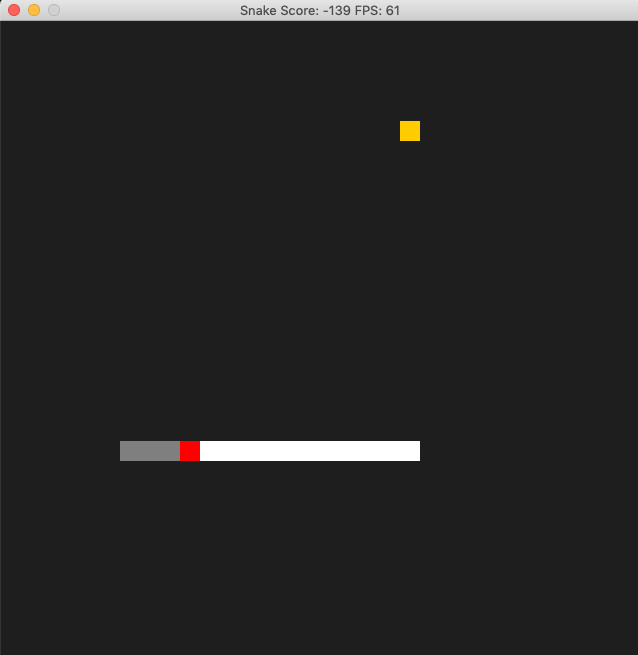
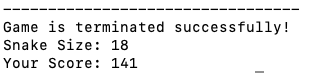

# Capstone: Snake Game

This project is to practice on objective oriented programming in C++.
The [starter code](https://github.com/udacity/CppND-Capstone-Snake-Game) and original [idea](https://codereview.stackexchange.com/questions/212296/snake-game-in-c-with-sdl) can be found by the hyperlink. In this repo, additonal features are listed as below:

1. A gray rock is added to the game to make the game more exciting. 

2. User is promted to enter the size of the rock (obstacle) to adjust the difficulty of the game.
3. Includes the panelty from hitting the rock in score calculation.

	

## How to play the game?
* Use arrow keys to controll the blue snake head direction. 

* The goal is to eat the yellow food, and avoid the rock for maximum score.

* Rock size is determined by user input.

	

* Snake body grows after eating the food. Score points will be increased.
* Snake head will turn red if it hit the rock. Score points will be deducted.
* The score is shown on the window title.
	

* Close the window to terminate the game.
* The final score will be shown on the terminal.  
	

## Project Criteria

 Item           | Criteria      | Specifications Met 	|
| :------------- |:-------------|:-------------------------|
| Loops, Functions, I/O     | 1. The project accepts user input and processes the input. | User is promted to enter rock size. The final score will be listed on the terminal after the game is ended. |
| Object Oriented Programming    | 2. The project uses Object Oriented Programming techniques. | Class `Rock` is created to hold rock size from user input with setter and getter.|
| Object Oriented Programming    | 3. Classes use appropriate access specifiers for class members. | Class `Rock` and  methods are integrated into `game.h` with appropirate specifiers.|
| Object Oriented Programming    | 4.All class members that are set to argument values are initialized through member initialization lists. | Class `Rock` set the defaultt `ob_size{3}`  and is set to a user value later.|
| Object Oriented Programming    | 5. Classes abstract implementation details from their interfaces. | All class member functions document the effects trhough function names and comments. |
| Memory Management    | 6. The project makes use of references in function declarations. |  The obstacle and food location are passed to `render` by reference. |

## Dependencies for Running Locally
* cmake >= 3.7
  * All OSes: [click here for installation instructions](https://cmake.org/install/)
* make >= 4.1 (Linux, Mac), 3.81 (Windows)
  * Linux: make is installed by default on most Linux distros
  * Mac: [install Xcode command line tools to get make](https://developer.apple.com/xcode/features/)
  * Windows: [Click here for installation instructions](http://gnuwin32.sourceforge.net/packages/make.htm)
* SDL2 >= 2.0
  * All installation instructions can be found [here](https://wiki.libsdl.org/Installation)
  * Note that for Linux, an `apt` or `apt-get` installation is preferred to building from source.
* gcc/g++ >= 5.4
  * Linux: gcc / g++ is installed by default on most Linux distros
  * Mac: same deal as make - [install Xcode command line tools](https://developer.apple.com/xcode/features/)
  * Windows: recommend using [MinGW](http://www.mingw.org/)

## Basic Build Instructions

1. Clone this repo.
2. Make a build directory in the top level directory: `mkdir build && cd build`
3. Compile: `cmake .. && make`
4. Run it: `./SnakeGame`.